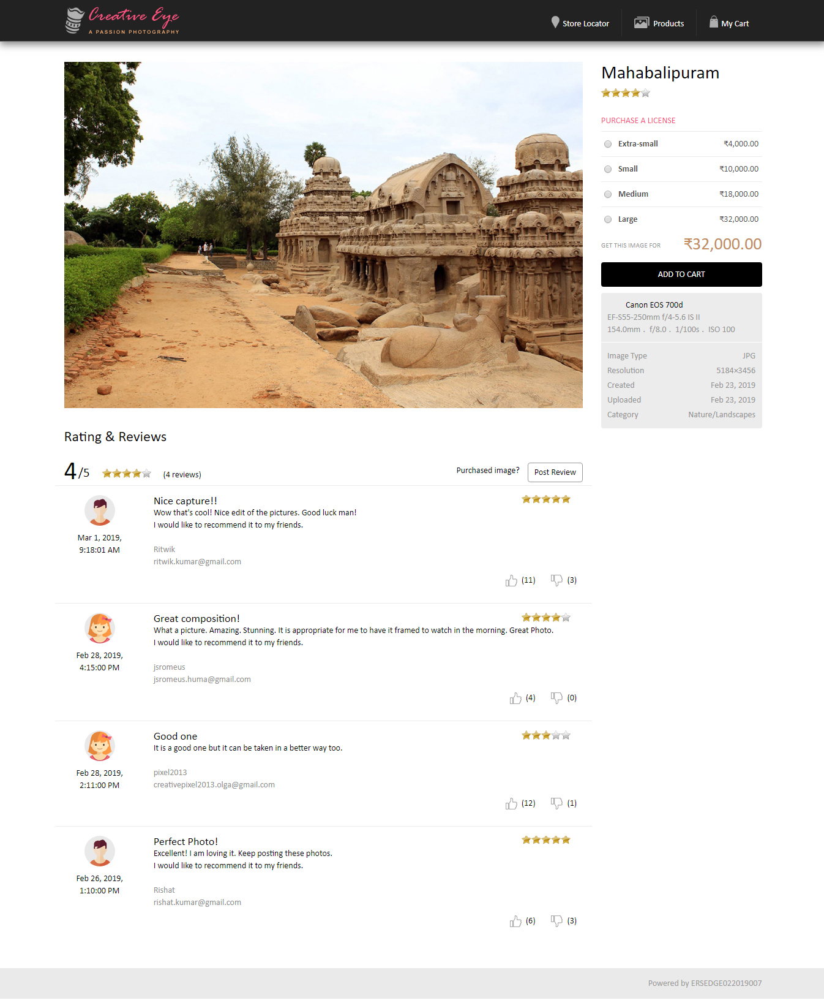
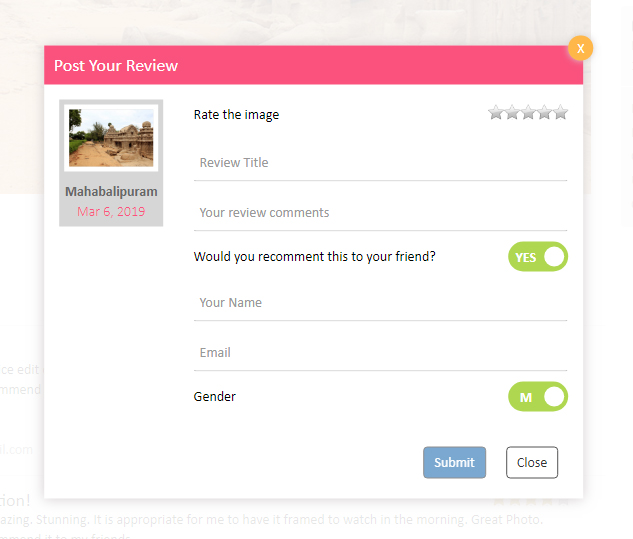
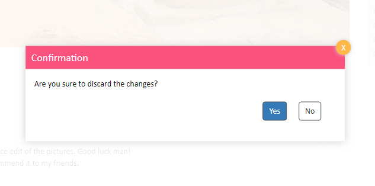
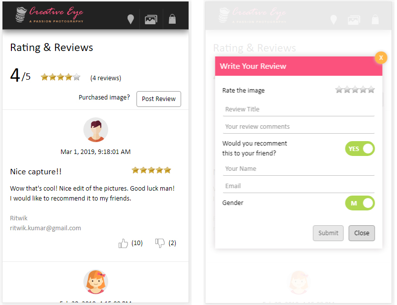

# Hackathon 2019 (Component: Review and ratings)

This project was generated with [Angular CLI](https://github.com/angular/angular-cli) version 6.0.8.

### Mobile view

## Demo
You may want to have a look at the demo https://hackathon2019.stackblitz.io

## Test cases

USE CASE 1
When	at the product-list page, you mouse over on any product and click on EYE icon
Then	It takes you to individual product page
Then	The current rating of the product is visible beneath product name

USE CASE 2
When	At product page, you go to Rating & Reviews section (below the image)
Then	A list of reviews is visible along with following details
1.	Date/time of post
2.	Reviewer details (Name/email/Gender)
3.	Review comments

USE CASE 3
When	In Rating & Reviews section (below the image), when you click on LIKE/DISLIKE review
Then	The no. of LIKES/DISLIKES increases respectively

USE CASE 4
When	In Rating & Reviews section (below the image), when you click on POST REVIEW button
Then	A pop up opens up and requires following details
1.	To rate the image
2.	Review title
3.	Review comments
4.	Would you like to recommend this to your friend (Yes/No)
5.	Your name
6.	Email 
7.	Gender

USE CASE 5
When	In Rating & Reviews section (below the image), when you click on POST REVIEW button
Then	The submit button should be initially disabled and should only get enabled once your form is ready to be submitted
Then	All the form elements should be filled and appropriate error should be displayed in case of error

USE CASE 6
When	in POST YOUR REVIEW popup, when you are in middle of filling up form and clicked on cancel button
Then	The current post review popup should disappear and a confirmation popup should appear asking “Are you sure to discard the changes?”
	
	
USE CASE 7
When	in POST YOUR REVIEW CONFIRMATION popup, if you click on YES button
Then	pop up should disappear 
Then	No change in product page

USE CASE 8
When	in POST YOUR REVIEW CONFIRMATION popup, if you click on NO button
Then	pop up should disappear and POST YOUR REVIEW popup should appear with already filled data

USE CASE 9
When	in POST YOUR REVIEW popup, if you click on SUBMIT button
Then	It should close the popup and the data you submitted should be visible in reviews section
Then	Based on your given rating, the overall rating should be updated.

