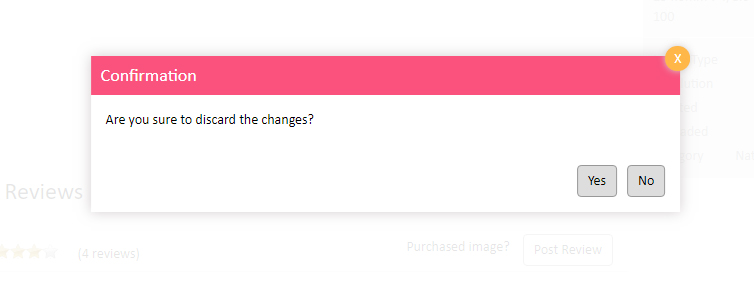

# Hackathon 2019 (Component: Review and ratings)

This project was generated with [Angular CLI](https://github.com/angular/angular-cli) version 6.0.8.

Content from cell 1 | Content from cell 2
Content in the first column | Content in the second column

### Mobile view

## Demo
You may want to have a look at the demo https://hackathon2019.stackblitz.io

## Test cases

