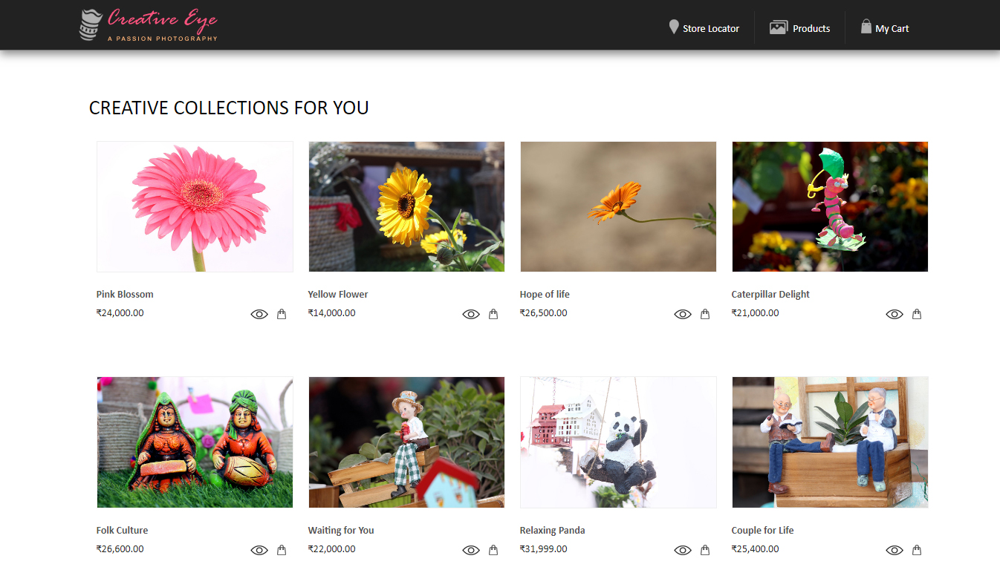
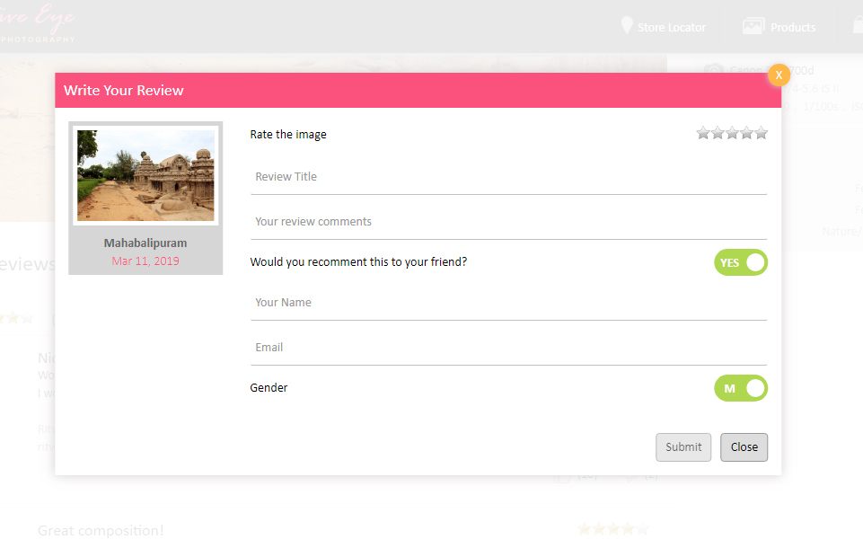

# Hackathon 2019


This project was generated with [Angular CLI](https://github.com/angular/angular-cli) version 6.0.8.
```javascript
function fancyAlert(arg) {
  if(arg) {
    $.facebox({div:'#foo'})
  }
}
```







### Mobile view


## Demo
You may want to have a look at the demo https://hackathon2019.stackblitz.io

## Test cases

